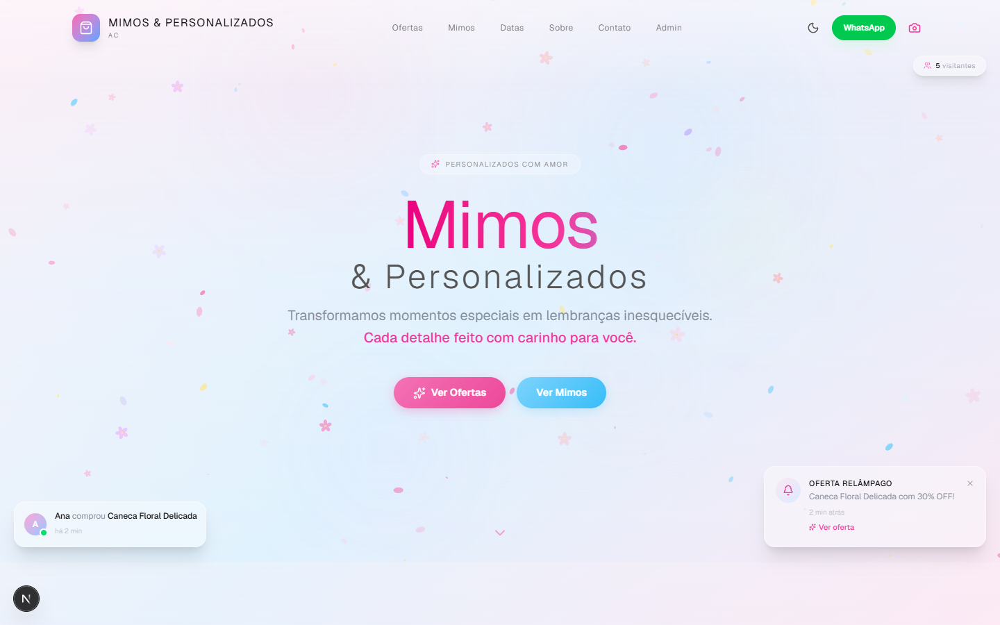
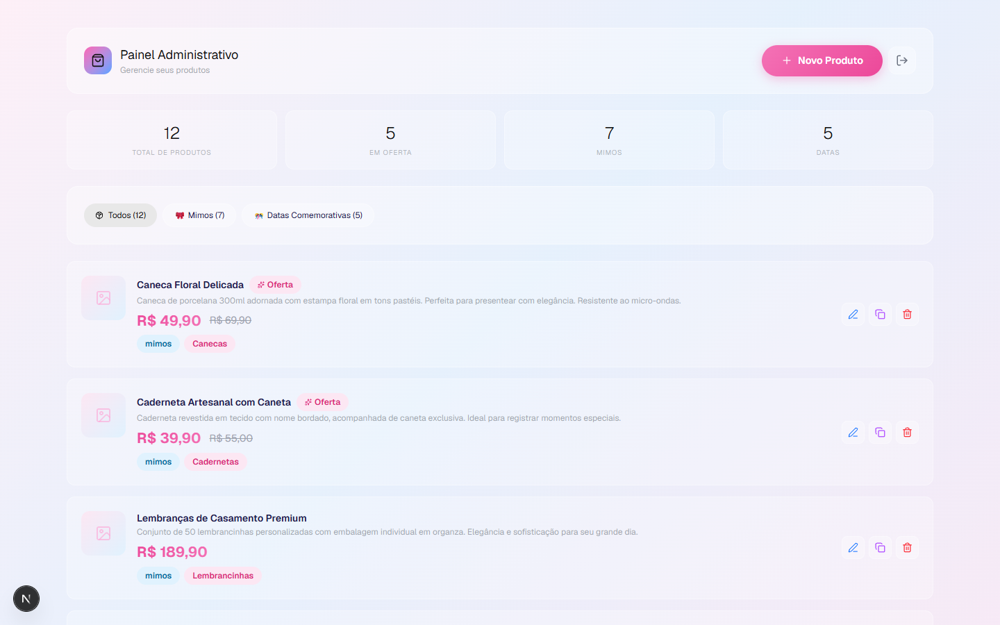

<p align="center">
  
</p>

<h1 align="center">🌸 Mimos & Personalizados AC</h1>

<p align="center">
  <b>Transformamos momentos especiais em lembranças inesquecíveis.</b>
  <br/>
  Loja virtual de presentes personalizados — canecas, cadernetas, lembrancinhas, kits e muito mais.
</p>

<p align="center">
  
  
  
  
</p>

---

## ✨ Funcionalidades

- 🛍️ **Catálogo de produtos** — Ofertas, Mimos e Datas Comemorativas com busca e filtros
- 📅 **Agenda de datas especiais** — Contagem regressiva para Dia das Mães, Natal, Páscoa e mais
- 💬 **WhatsApp integrado** — Compre diretamente pelo WhatsApp com mensagem personalizada
- 🎨 **Design elegante** — Tema pastel, glassmorphism, efeitos de parallax e animações
- 🌙 **Modo escuro** — Alterna entre claro/escuro com persistência
- 📱 **100% responsivo** — Funciona perfeitamente em celular, tablet e desktop
- 👤 **Painel Admin** — CRUD completo de produtos, controle de ofertas, relatórios
- 🔔 **Notificações sociais** — Provas sociais falsas e contador de visitantes
- 🌸 **Folhas e flores animadas** — Efeito visual no hero com canvas

## 🛠️ Tecnologias

| Tecnologia | Uso |
|------------|-----|
| Next.js 16 | Framework React com App Router |
| TailwindCSS v4 | Estilização utilitária |
| Framer Motion | Animações e transições |
| Lucide React | Ícones leves e elegantes |
| TypeScript | Tipagem segura |
| localStorage | Persistência de dados (produtos, tema, preferências) |

## 📸 Galeria

| Hero | Produtos | Admin |
|------|----------|-------|
|  |  |  |

## 🚀 Começando

```bash
git clone https://github.com/luiz199/mimos-personalizados.git
cd mimos-personalizados
npm install
npm run dev
```

Acesse [http://localhost:3000](http://localhost:3000).

## 📦 Produtos Padrão

Ao iniciar, o sistema carrega automaticamente 12 produtos de exemplo nos categorias:
- **Mimos**: Canecas, Cadernetas, Lembrancinhas, Caixas, Topos de Bolo, Agendas, Kits
- **Datas**: Dia das Mães, Páscoa, Natal, Casamento, Aniversário e mais

Todos os dados são salvos no `localStorage` do navegador.

## 🌐 Deploy

O deploy mais simples é pelo **Vercel**:

[](https://vercel.com/new/clone?repository-url=https://github.com/luiz199/mimos-personalizados)

---

<p align="center">
  Feito com 💖 por <a href="https://github.com/luiz199">luiz199</a>
</p>
